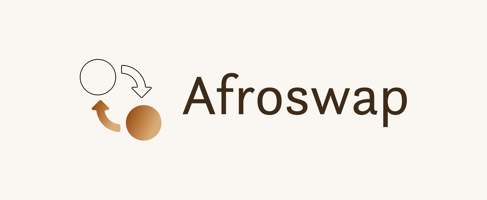

# Afroswap 💰
https://afroswap.org

## Instructions
* Afroswap currently runs on the `Rinkeby` testnet
* Create 2 accounts in Metamask one called `AfroswapDev` and another called `AfroswapUser`
* Get some tesnet ETH from the `Rinkeby Faucet` here: [https://faucet.rinkeby.io/](https://faucet.rinkeby.io/)
* Get some testnet `DAI` from [https://app.compound.finance/](https://app.compound.finance/)
click on `DAI` then `Withdraw` the `Faucet` at the bottom
* Connect to [https://app.uniswap.org/#/pool](https://app.uniswap.org/#/pool) with your `AfroswapUser` account
* More instructions coming...

## License
© Copyright 2020 Afroswap -  MIT